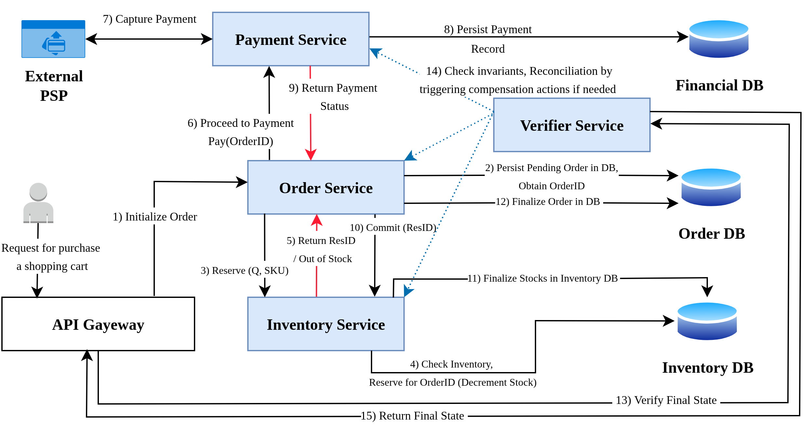
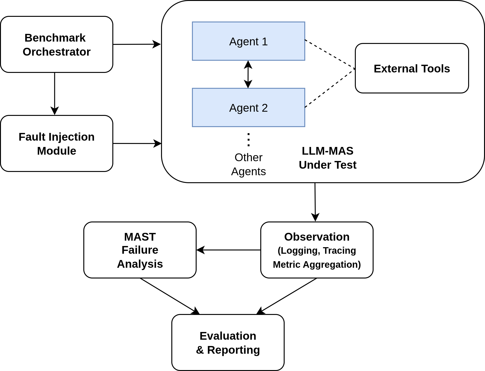
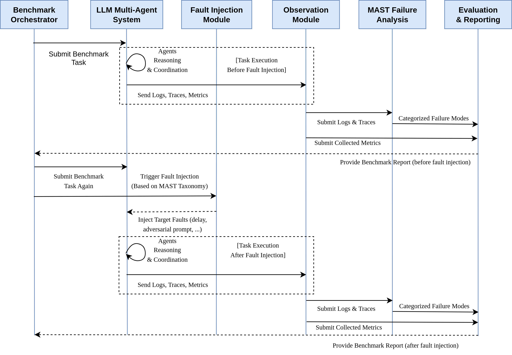

# Microservice Systems & LLM-Based Multi-Agent Systems Benchmarking

In this project, we're going to benchmark Microservice (MS) and LLM-based Multi Agent systems (LLM-MAS).

A case study for retail supply chain management is implemented with both systems, and various failure scenarios injected in the system.

## Microservice System Version:

### Service Communications:

1. Synchronous via REST API call --> ms_ec/scenario1
2. Synchronous via gRPC API call --> ms_ec/scenario2
3. Asynchronous via Message Broker using RabbitMQ --> ms_ec/scenario3

## LLM Multi Agent System Version:

### Agents Communications:

1. Synchronous via Direct Call State Passing/Update --> llm-mas-ec/scenario1-ollama
2. Asynchronous via Message Broker using RabbitMQ --> llm-mas-ec/scenario2-ollama

--------------------------

## Failure Injections:

1. Injecting Delay in communication response
2. Dropping response messages in async communication

--------------------------

## Benchmark Trial Types:

   1. Sequential Order Placement trials
   2. Parallel Order Placement trials

## Benchmark Metrics:

  1. Total Response Time
  2. CPU / Memory Usage
  3. Communication Overhead / Payload Size
  4. Eventual Consistency vs. Availability
     1. Rate of achieving eventual consistency
     2. ...

--------------------------

New Benchmark Designs for LLM-MAS

